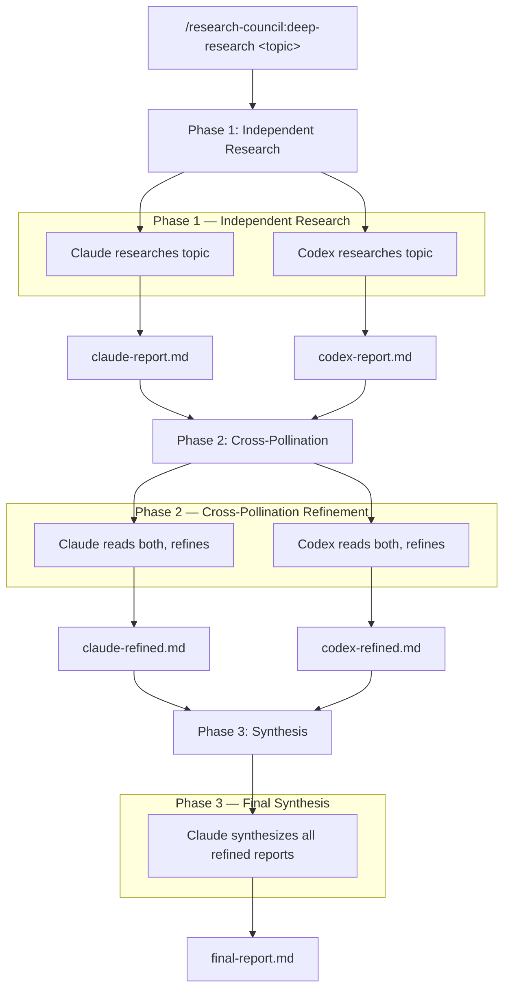

# Research Council

A [Claude Code](https://docs.anthropic.com/en/docs/claude-code) plugin that orchestrates deep research across **two coding agents** — [Claude Code](https://docs.anthropic.com/en/docs/claude-code) and [Codex CLI](https://github.com/openai/codex) (OpenAI) — running in parallel with cross-pollination refinement and final synthesis.

> **Note:** Gemini CLI was previously included as a third agent but was removed due to persistent flakiness — frequent quota errors, sandbox limitations requiring workarounds, and an internal retry loop that hangs indefinitely on rate limits. The two-agent setup (Claude + Codex) is more reliable and still produces high-quality cross-pollinated research.

## How it Works

Run the `/research-council:deep-research` slash command inside Claude Code:

```
/research-council:deep-research Next.js vs SvelteKit for production web apps in 2026: performance, DX, ecosystem maturity, and deployment options
```

In some setups, the unqualified alias `/deep-research` may also work. Prefer the namespaced form above for consistency.

Each agent uses the **most powerful model** from its provider with **thinking/reasoning turned all the way up** (see [Models Used](#models-used)). A `--test` flag is available that swaps in small, cheap models for testing the pipeline.

The plugin runs a 3-phase pipeline:

1. **Independent Research** — Both agents research the topic simultaneously, each iterating with web searches until they're satisfied with depth and coverage
2. **Cross-Pollination Refinement** — Each agent reads both reports and refines its own, using the other as a springboard for *new* investigation (not copying). Agents are prompted to be skeptical — they independently verify peer claims via web search rather than accepting them at face value
3. **Synthesis** — Claude reads all refined reports and produces a single final report organized by theme

The key step is **cross-pollination**. Different AI providers have different training data, search behaviors, and analytical tendencies. When Agent A reads Agent B's report it provides an opportunity to discover angles it missed, contradictions to resolve, and gaps neither agent independently covered. This produces research that's substantially deeper than any single agent could achieve alone, or than simply merging two independent reports.




## Prerequisites

You need both coding CLIs installed and authenticated:

### Claude Code
```bash
# Should already be installed if you're reading this
claude --version
```

### Codex CLI (OpenAI)
```bash
npm install -g @openai/codex
codex login
```

### jq (JSON processor)
```bash
# macOS
brew install jq

# Linux
sudo apt install jq
```

## Installation

### From the command line
```bash
claude plugin marketplace add hamelsmu/research-council
claude plugin install research-council@research-council
```

### From within Claude Code
```
/plugin marketplace add hamelsmu/research-council
/plugin install research-council@research-council
```

### Upgrading
```bash
claude plugin update research-council@research-council
```

### Manual installation (for development)
```bash
git clone https://github.com/hamelsmu/research-council.git
# Then in Claude Code:
claude --plugin-dir /path/to/research-council
```

## Usage

### Full research (production models, up to 10 iterations per agent)
```
/research-council:deep-research What are the leading approaches to nuclear fusion energy and how close are they to commercialization?
```

### Test mode (cheap models, 2 iterations — for testing the pipeline)
```
/research-council:deep-research --test What is the history of the Panama Canal?
```

### Cancel an active session
```
/research-council:cancel-research
```

### Monitor progress

While research is running, Claude's UI shows a spinner. Open another terminal to watch progress:

```bash
tail -f research/*/progress.log
```

## Output

Reports are saved to `research/<id>/`:

```
research/20260222-143000-a1b2c3/
├── progress.log              # Live progress from all agents
├── claude-report.md          # Phase 1: Claude's initial research
├── codex-report.md           # Phase 1: Codex's initial research
├── claude-refined.md         # Phase 2: Claude's cross-pollinated refinement
├── codex-refined.md          # Phase 2: Codex's cross-pollinated refinement
├── final-report.md           # Phase 3: Synthesized final report
├── claude-stdout.log         # Claude Phase 1 agent output
├── codex-stdout.log          # Codex Phase 1 agent output
├── claude-refine-stdout.log  # Claude Phase 2 agent output
├── codex-refine-stdout.log   # Codex Phase 2 agent output
└── synthesis-stdout.log      # Phase 3 synthesis agent output
```

## Models Used

### Production (default)

| Agent | Model | Reasoning |
|-------|-------|-----------|
| Claude | `claude-opus-4-6` | effort: max |
| Codex | `gpt-5.3-codex` | reasoning_effort: high |

### Test mode (`--test`)

| Agent | Model | Reasoning |
|-------|-------|-----------|
| Claude | `claude-haiku-4-5-20251001` | effort: low |
| Codex | `gpt-5.1-codex-mini` | reasoning_effort: low |

## How the Loop Mechanisms Work

Each agent iterates on its research using the best available mechanism for that CLI:

- **Claude**: Native [Stop hook](https://docs.anthropic.com/en/docs/claude-code/hooks) — blocks exit and feeds a "keep researching" prompt back until the agent marks its report complete
- **Codex**: Bash wrapper loop with `codex exec resume --last` — since Codex lacks hooks, we wrap it in an external loop that checks for completion between iterations

Each agent signals completion by writing `<!-- RESEARCH_COMPLETE -->` at the end of its report.

## Troubleshooting

### "Missing required CLI tools"
Install the missing tools listed in the error. Both CLIs (claude, codex) plus jq must be available on PATH.

### "codex may not be authenticated"
Run `codex login` to authenticate with your OpenAI account.

### No reports produced
Check the agent stdout logs in `research/<id>/`:
- `claude-stdout.log`
- `codex-stdout.log`

Common causes: authentication failures, model not available on your subscription tier, network issues.

### An agent failed
Individual agent failures are tolerated — the failed agent is skipped and the remaining agent continues. The final synthesis will note reduced coverage. Check the agent's stdout log for details.

### Research seems stuck
Monitor `research/<id>/progress.log`. If an agent is stuck, you can cancel with `/research-council:cancel-research` and try again. The orchestrator has a 2-hour timeout as a safety net.

### Stop hook interfering with other sessions
The plugin's Stop hook tracks which Claude Code session started the research. If the original session is still actively running phases (its lock is alive — PID exists and lock is less than 2 hours old), other sessions skip the hook silently. If the lock is stale or the original session is gone, a new session automatically adopts the orphaned research: it re-stamps the session ID in the state file and continues from whatever phase was in progress. State files older than 5 hours are automatically cleaned up regardless.

### "A research session is already active"
Run `/research-council:cancel-research` first, or check if a previous session is still running.

## Architecture

The plugin uses Claude Code's Stop hook for orchestration. When you run `/research-council:deep-research`, the command creates a state file and finishes. The Stop hook then takes over and runs all three phases sequentially:

1. Launches both research agents as parallel child processes
2. Waits for all to complete
3. Launches both refinement agents in parallel
4. Waits for all to complete
5. Launches a dedicated Claude synthesis sub-agent
6. Waits for synthesis to complete and marks the session as done

All three phases run entirely within the Stop hook — no control is returned to the main session until the final report is written. This design avoids the 10-minute Bash tool timeout limitation — the Stop hook has a 2-hour timeout, giving agents plenty of time for deep research.

## License

MIT
